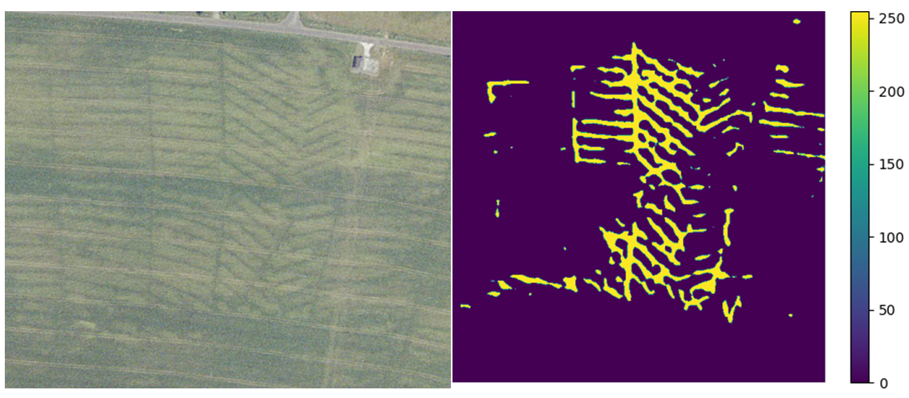

# Automatic detection of meliorations

Project aims to automatically detect meliorations on orthophoto maps from http://geoportal.cuzk.cz using machine learning. Images from given coordinates are exported using GDAL in QGIS. Meliorations are detected on the images by binary semantic segmentation with a convolutional neural network. Pixels on the images are classified into two classes: is/is not a melioration; the output of the network is a binary segmentation mask. The network used is U-Net with EfficientNetB0 or VGG16 backbone pretrained on ImageNet. Use to detect whether meliorations are present on an image; accuracy is too low for precise location of all pipes due to low contrast and lack of training data.

## How to use

 * run in terminal unless stated otherwise
 * provide coordinates of image centers in a .csv file (see `data.csv` for formatting)
 * run `export.py` in QGIS Python Console
 * run `delete.py` to delete images from undefined layers
 * download a trained model (trained on GPU in Linux, not guaranteed to work on other systems)
   * EfficientNetB0 backbone: https://drive.google.com/file/d/1O3S760vMr4afAHM_XOiaHAQCZpsx3knN
   * VGG16 backbone: https://drive.google.com/file/d/1DRrk0IqLxqjXEHFiF7wz83qs-4VwM1TF
 * run `melio_finder_effnet.py` or `melio_finder_vgg.py` to find meliorations on images

## How to train (optional)

 * find training images and create matching binary segmentation masks
 * run `train_effnet_unet.py` or `train_vgg_unet.py` to train melio finder
